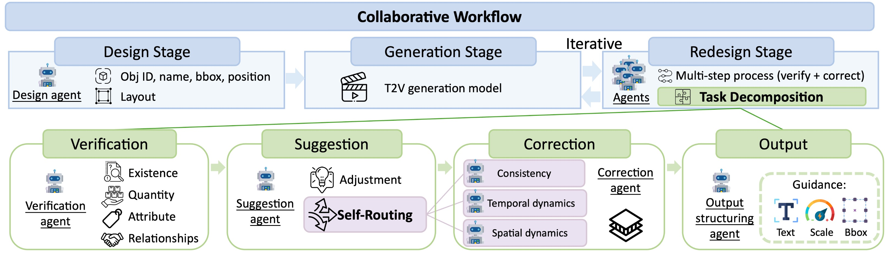

#  GENMAC: Compositional Text-to-Video Generation with Multi-Agent Collaboration

<a href='https://karine-h.github.io/GenMAC/'></a>
<a href='https://arxiv.org/abs/2412.04440'></a> 


## Method Overview


This repository provides the inference code for **GenMAC**, enabling compositional text-to-video generation. Follow the steps below to set up and generate your videos. 


## 🔨 Installation

### Step 1: Install Environment

Set up the required environment using Anaconda:

```bash
conda create -n genmac python=3.9 -y
conda activate genmac
pip install -r requirements.txt
```

### Step 2: Download Required Files

1. **Pretrained Model**  
   - Download the pretrained model from [Hugging Face](https://huggingface.co/VideoCrafter/VideoCrafter2/blob/main/model.ckpt). Place the model in the following directory (checkpoints/base_512_v2/model.ckpt):  
     ```
     mkdir -p checkpoints/base_512_v2
     huggingface-cli download VideoCrafter/VideoCrafter2 model.ckpt --local-dir checkpoints/base_512_v2
     ```

2. **Tokenizer**  
   - Download the tokenizer from [this link](https://huggingface.co/ali-vilab/text-to-video-ms-1.7b/tree/main). Place it in the following directory (checkpoints/tokenizer):  
     ```
     huggingface-cli download ali-vilab/text-to-video-ms-1.7b \
        --include "tokenizer/*" \
        --local-dir checkpoints
     ```


## 💡 Quick Start

### Step 1: Prepare API Key
GenMAC uses GPT-4o for its multi-agent collaboration. To enable access to the model:

1. Add your OpenAI API key to the file:

    ```
    utils/api_key.py
    ```
2. Ensure that your system has internet access to connect to OpenAI's servers.

### Step 2: Run Inference
To generate videos, use the following command:

```
python scripts/run_t2v.py
```
**Note**: This process requires approximately 78GB of GPU VRAM

------------------------------------------------

### Additional Configurations
- Specify the Prompt

  Update the prompt text in the following file:


  ```assets/prompt/prompt.txt```
- Adjust Iterations

  Modify the maximum iteration number (MAX_ITER) in Line 22 of the script (scripts/run_t2v.py):

  *e.g.*, ```MAX_ITER = 5```
- Set Seed

  Set the seed value in Line 13 of the script (scripts/run_t2v.py):

  *e.g.*, ```seed = 12345678```

### Output
Generated videos will be saved in the following directory:

```results/<seed>_<timestamp>/iter_<MAX_ITER-1>/video/results_t2v_baseline_0/base_512_v2/```

Example:
If the following parameters are used:

- MAX_ITER = 5
- seed = 12345678
- Script executed on 2025-07-25-22-21-24
The generated videos will be located in:

```results/12345678_2025-07-25-22-21-24/iter_4/video/results_t2v_baseline_0/base_512_v2/```


## ⭐ Acknowledgements
We would like to thank the following great open-source projects and research works: [LVD](https://github.com/TonyLianLong/LLM-groundedVideoDiffusion), [VideoCrafter2](https://github.com/AILab-CVC/VideoCrafter).

## 📚 Citation
```
@article{huang2024genmaccompositionaltexttovideogeneration,
      title={GenMAC: Compositional Text-to-Video Generation with Multi-Agent Collaboration}, 
      author={Kaiyi Huang and Yukun Huang and Xuefei Ning and Zinan Lin and Yu Wang and Xihui Liu},
      year={2024},
      eprint={2412.04440},
      archivePrefix={arXiv},
      primaryClass={cs.CV},
      url={https://arxiv.org/abs/2412.04440}, 
}
```
