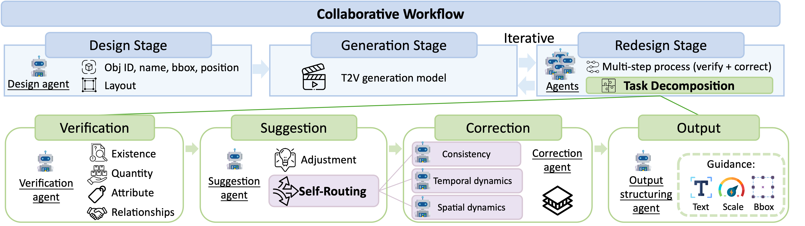

# GENMAC: Compositional Text-to-Video Generation with Multi-Agent Collaboration

<a href='https://karine-h.github.io/GenMAC/'></a>
<a href=''></a> 

**Code will come soon.**

## Method Overview


## Citation
If you find _GenMAC_ useful in your project, please cite our work:
```
@article{
}
```
